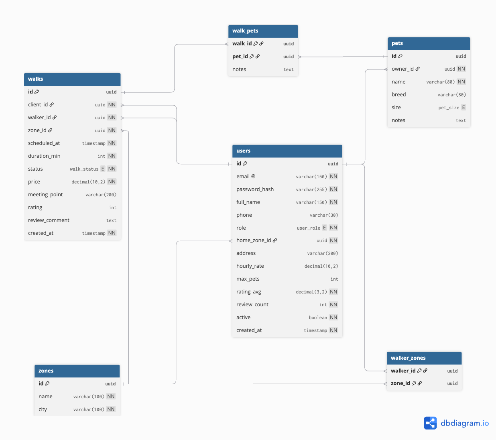

# TP 🐾

A web application that connects pet owners with dog walkers in the City of Buenos Aires (CABA), allowing walkers to publish their availability by zone, manage a walk schedule, and letting owners view each walker's coverage area on a map.

**Capstone Project (Trabajo Final Integrador) — Tecnicatura Universitaria en Programación a Distancia (TUPaD), UTN**

## Team

- Gastón Lell
- Juan Cruz Leal
- Gabriel Lovera

## Table of Contents

- [Purpose](#purpose)
- [MVP Scope](#mvp-scope)
- [Tech Stack](#tech-stack)
- [Architecture](#architecture)
- [Data Model](#data-model)
- [Design Decisions](#design-decisions)
- [Installation and Setup](#installation-and-setup)
- [Repository Structure](#repository-structure)
- [Delivery Roadmap](#delivery-roadmap)

## Purpose

The City of Buenos Aires is undergoing a structural demographic shift: its pet population now far exceeds its child population (493,676 dogs and 368,176 cats compared to 460,696 children under 14, according to INDEC 2022). This has driven growing demand for dog walking services, yet coordination between owners and walkers is still handled informally today like WhatsApp, social media with no system to centralize availability, coverage area, and scheduling.

This project is looking for replacing that informal coordination with a centralized, reliable platform.

## MVP Scope

**In scope:**
- Registration and profiles for two roles: Owner and Walker
- Walker profile publishing with coverage zones (predefined neighborhoods), time availability, and a reference hourly rate
- Coverage zone visualization on a map (Leaflet + OpenStreetMap)
- Walker search and matching by zone and availability
- Walk scheduling: request, accept/reject, view agreed times
- Basic history of scheduled walks

**Out of scope:**
- Integrated online payments
- Real-time GPS tracking during the walk
- Native mobile app (the web app will be responsive)
- Rating/review system (future enhancement)
- Free-form zone drawing on the map (predefined neighborhoods are used instead of geospatial polygons)

## Tech Stack

| Layer | Technology |
|---|---|
| Frontend | TypeScript + React |
| Backend | Java + Spring Boot |
| Database | PostgreSQL |
| Map | Leaflet + OpenStreetMap |
| Authentication | Spring Security + JWT |
| Frontend Deployment | Vercel / Netlify |
| Backend Deployment | Render / Railway |
| Database Deployment | Railway / Supabase |

## Architecture

A layered monolithic architecture (controller → service → repository) built with Spring Boot. A microservices architecture is out of the scope because the project's domain (owners, walkers, walks, zones) has no modules with independent lifecycles or teams that would justify that operational complexity; a layered monolith is achievable within the course timeline and avoids over-engineering.

## Data Model




The full DDL script is available at [`/database/schema.sql`](./database/schema.sql).

## Design Decisions

### Single `USERS` table with a `role` field

A single `USERS` table with a `role` field was chosen over separate tables (`OWNERS` and `WALKERS`) from the start, because both roles share the same core identity data — name, email, password, national ID — and the system has only two fixed, mutually exclusive roles, with no need for a user to hold multiple roles at once or for new roles to be added dynamically.

This is a deliberate trade-off that avoids the complexity of a normalized roles table (`roles` plus a `user_roles` join table), which would only add value if the system required configurable or multiple roles per user, for this case outside the MVP's scope. 

## Installation and Setup

> ⚠️ Section to be completed 

```bash
# Backend
cd backend
./mvnw spring-boot:run

# Frontend
cd frontend
npm install
npm run dev
```

Required environment variables (backend): `DB_URL`, `DB_USER`, `DB_PASSWORD`, `JWT_SECRET`.

## Repository Structure

```
walkingpet/
├── backend/          # REST API — Java + Spring Boot
├── frontend/         # Web app — TypeScript + React
├── database/
│   └── schema.sql    # DDL script — PostgreSQL
├── docs/
│   └── proposal.md   # Project proposal (1st Delivery)
└── README.md
```

## Delivery Roadmap

| Milestone | Deadline | Status |
|---|---|---|
| 1st Delivery — Proposal + Repository | 08/30/2026 | ✅ |
| 2nd Delivery — DB design and modules | 09/27/2026 | 🔄 In progress |
| Final Delivery — Report, video, and deployment | 11/14/2026 | ⏳ Pending |
| Oral Defense | Exam board | ⏳ Pending |